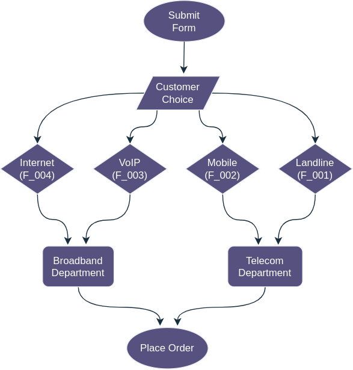

# Challenge - The Firmament Project

## Table of Contents
- [Background](#background)
- [The Requirements](#the-requirements)
- [The Challenge](#the-challenge)
  - [Level 1: Routing Logic (Broadband & Telecom Departments)](#level-1-routing-logic-broadband--telecom-departments)
  - [Level 2: Validation Logic (No products Requested)](#level-2-validation-logic-no-products-requested)
  - [Level 3: Validation Logic (Mandatory Fields & Data Types)](#level-3-validation-logic-mandatory-fields--data-types)
  - [Level 4: Transformation Logic (Product Codes)](#level-4-transformation-logic-product-codes)
  - [Level 5: No Data Structure! (It's just a List of strings!)](#level-5-no-data-structure-its-just-a-list-of-strings)

## Background:

We are a broadband & telecommunication company, named `Firmament` we have the following products:
- Internet (Product code: `F_004`)
- VoIP (Product code: `F_003`)
- Mobile (Product code: `F_002`)
- Landline (Product code: `F_001`)

When a customer buys one of our products, they submit a form with their details, and the products they want to purchase.
Some products belong to a different department, and each department has a different process for handling requests. To be
precise, the `Internet` and `VoIP` products belong to the `Broadband` department, while the `Mobile` and `Landline` products
belong to the `Telecom` department.

`Firmament` used to be a small company, and in the past, these form requests were handled manually by our sales team.
However, as the company grew, the number of requests increased, and the manual process became too cumbersome to handle.

## The Requirements:

Firmament decided to automate the process by building a web application that would allow customers to submit their requests
online, and have them automatically routed to the right department.

In this new process, the request comes in the form of a key-value pairs with the following structure:

```json
{
    "name": "John Doe",
    "email": "john.doe@email.com",
    "phone": "0123456789",
    "address": "123, Some Street, Some City, Some Country",
    "Internet": "true",
    "voip": "false",
    "Mobile": "true",
    "Landline": "false"
}
```

Where the `name`, `email`, `phone`, and `address` fields are **mandatory**, and the `Internet`, `VoIP`, `Mobile`, and `Landline`
fields are optional. The value of each product field can **either** be `true` or `false`, indicating whether the customer
wants to purchase that product or not.

In order, to correctly process their request, we need to know what products they have, so we can route them to the
right department. For example, if they have the `Internet` product, we need to route them to the `Broadband` department,
and if they have the `Mobile` product, we need to route them to the `Telecom` department.



Your job is to design and implement a system that would allow us to process these requests so customers can successfully
place their orders.

## The Challenge:

### Level 1: Routing Logic (Broadband & Telecom Departments)

As per requirements, some products belong to a different department, and each department has a different process for
handling requests. So the first level is about routing the request to the right department.

TASK: Based on the requested products, you need to route the request to the right department.

If your received request has the `Internet` or `VoIP` products, you need to:
- Print a message that says: `Routing to Broadband department!`

If your received request has the `Mobile` or `Landline` products, you need to:
- Print a message that says: `Routing to Telecom department!`

If your received request that has both `Internet` or `VoIP` products, and `Mobile` or `Landline` products, you need to:
- Print a message that says: `Routing to Broadband & Telecom departments!`

You need to apply your solution inside the `challenge1` function in the `challenge1` file. 
It takes an object named `Request` as an argument which has the same structure as the one outlined in the requirements.
To start, head over to the prepared Kotlin's online playground:

- [play.kotlinlang.org - Level 1: Routing Logic (Broadband & Telecom Departments)](https://pl.kotl.in/GkTKfp2Wm)

### Level 2: Validation Logic (No products Requested)

What if the customer didn't request any products? In this case, we need to reject their
request, so we don't waste our time and resources processing it.

TASK: You need to validate the request data by checking that at least one product is requested.

If no product is requested, you need to:
- Print an error message that says: `No products requested!`

You need to apply your solution inside the `challenge2` function in the `challenge2` file. 
It takes an object named `Request` as an argument which has the same structure as the one outlined in the requirements.
To start, head over to the prepared Kotlin's online playground:

- [play.kotlinlang.org - Level 2: Validation Logic (No products Requested)](https://pl.kotl.in/MrOn0eWyW)

### Level 3: Validation Logic (Mandatory Fields & Data Types)

The requirements outlined that some fields are considered mandatory, which means they must be present in
the request data (i.e. not empty). Therefore, this level is about validating the request data, and making
sure that the mandatory fields are present.

TASK: You need to validate the request data by checking that the mandatory fields are not empty.

If any mandatory field is empty, you need to:
- Print an error message that says: `A mandatory field is missing!`

You need to apply your solution inside the `challenge3` function in the `challenge3` file. 
It takes an object named `Request` as an argument which has the same structure as the one outlined in the requirements.
To start, head over to the prepared Kotlin's online playground:

- [play.kotlinlang.org - Level 3: Validation Logic (Mandatory Fields & Data Types)](https://pl.kotl.in/Y5QMInxEz)

### Level 4: Transformation Logic (Product Codes)

Firmament decided to enrich the customer request date by adding the product codes to it. This will help us
in the future to process the request, and it will also help us to keep track of the products that the customer
has purchased as if in the future the interest product changes to `F_044` for example, we can still know that
the customer has purchased an older model of the `Internet` product.

TASK: You need to append the product codes to each product in the request data.

If the customer has the `Internet` product, you need to:
- Print the message: `Internet product code: F_004`

If the customer has bought the `VoIP` and `Mobile` products, you need to:
- Print the message: `VoIP product code: F_003`
- Print the message: `Mobile product code: F_002`

And so on...

So a happy path scenario output with all of our logic combined for a customer who has bought the
`Internet` and `Mobile` products would be:

```
Routing to Broadband & Telecom departments!
Internet product code: F_004
Mobile product code: F_002
``` 

You need to apply your solution inside the `challenge4` function in the `challenge4` file. 
It takes an object named `Request` as an argument which has the same structure as the one outlined in the requirements.
To start, head over to the prepared Kotlin's online playground:

- [play.kotlinlang.org - Level 4: Transformation Logic (Product Codes)](https://pl.kotl.in/oM8WayQLn)

### Level 5: No Data Structure! (It's just a List of strings!)

So far you had a data structure to work with, but now you don't! You only have a list of strings, and you need to parse
it. The list of string is guaranteed to be in the following format:

```text
INDEX: 0   , 1    , 2    , 3      , 4       , 5   , 6     , 7  
      [NAME, EMAIL, PHONE, ADDRESS, INTERNET, VoIP, MOBILE, LANDLINE]
```

So a concrete example would be:

```text
[ 
  "John Doe",
  "john.doe@email.com",
  "0123456789",
  "123, Some Street, Some City, Some Country",
  "true",
  "false",
  "true",
  "false"
]
```

Can you still solve level 1 till 4 with this new data structure?

You need to apply your solution inside the `challenge5` function in the `challenge5` file. 
It takes a List of Strings named `Request` as an argument which has the same structure as in this task.
To start, head over to the prepared Kotlin's online playground:

- [play.kotlinlang.org - Level 5: No Data Structure! (It's just a List of strings!)](https://pl.kotl.in/wbq5lQPLe)

HINT: You can still use the existing Request.

___